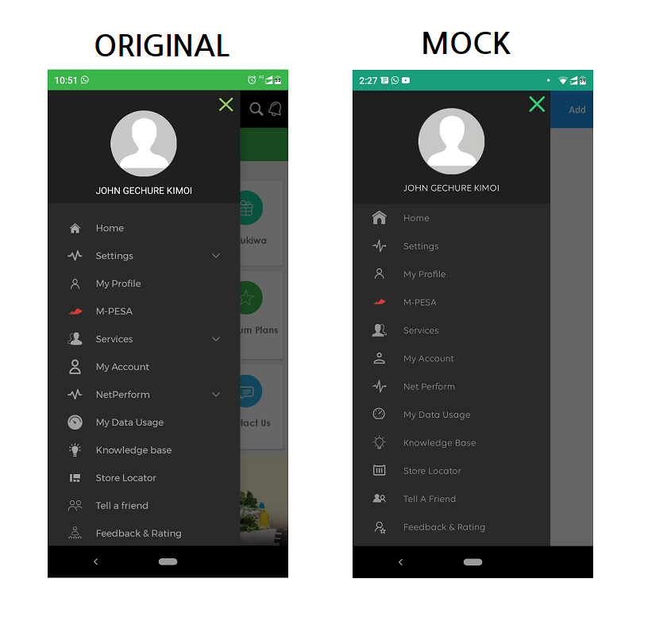

# mySafaricom UI Mock
This is a project to try and mock the safaricom mobile app user interface , am building it using the Xamarin Forms ,.NET Framework for building cross platform native mobile applications 

## Activity Number 1: Verify Phone Number 

## Activity Number 2: Login Page

## Activity Number 3: Navigation Drawer

